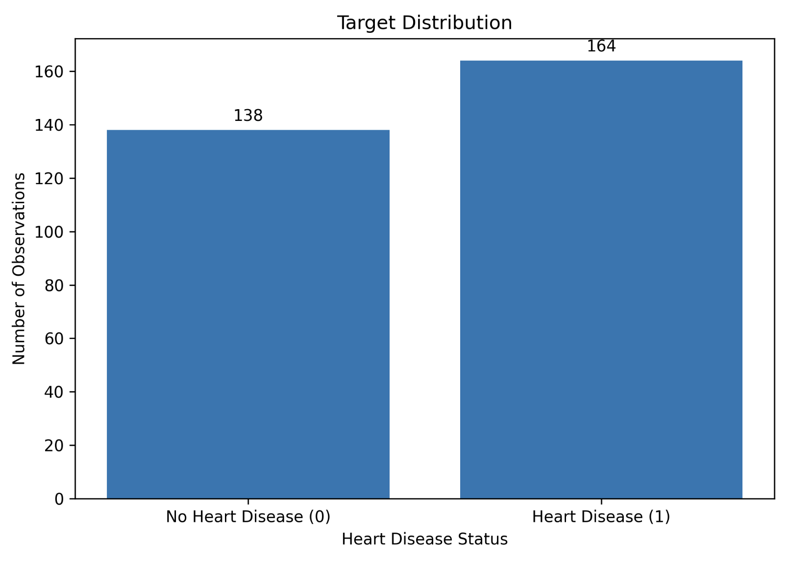
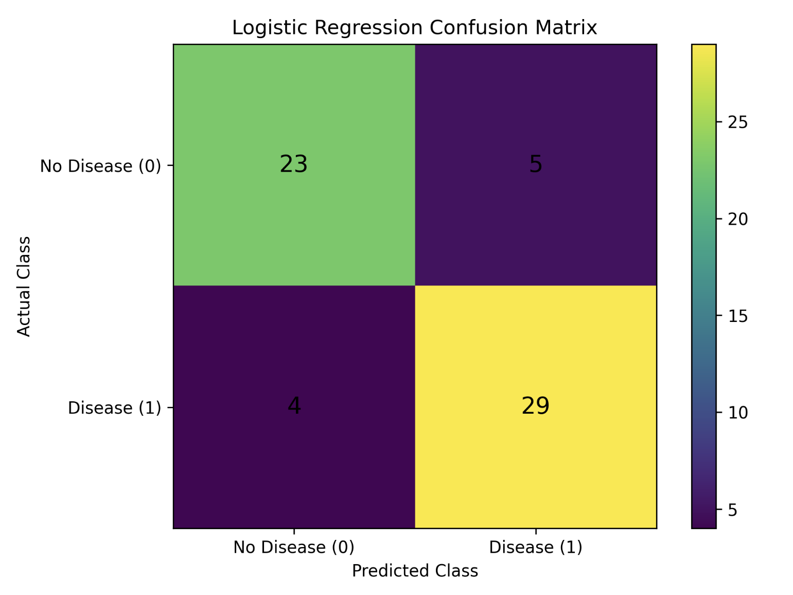
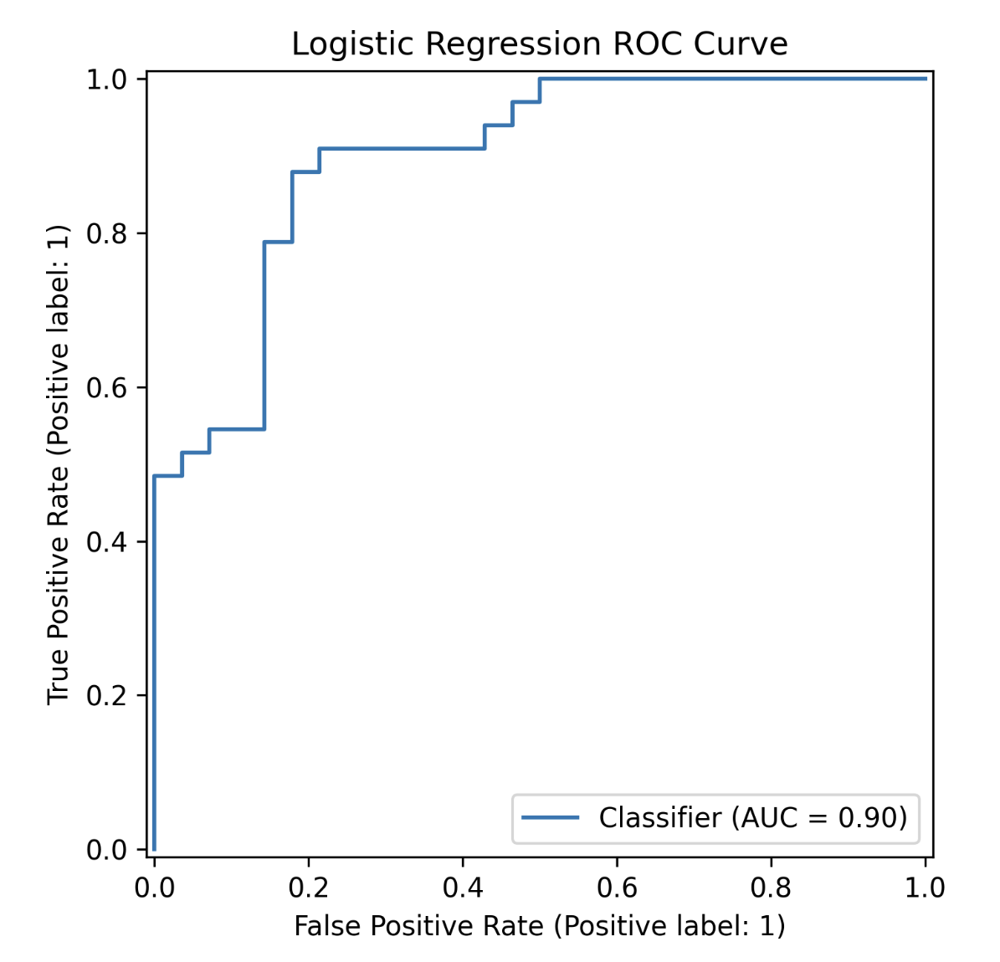
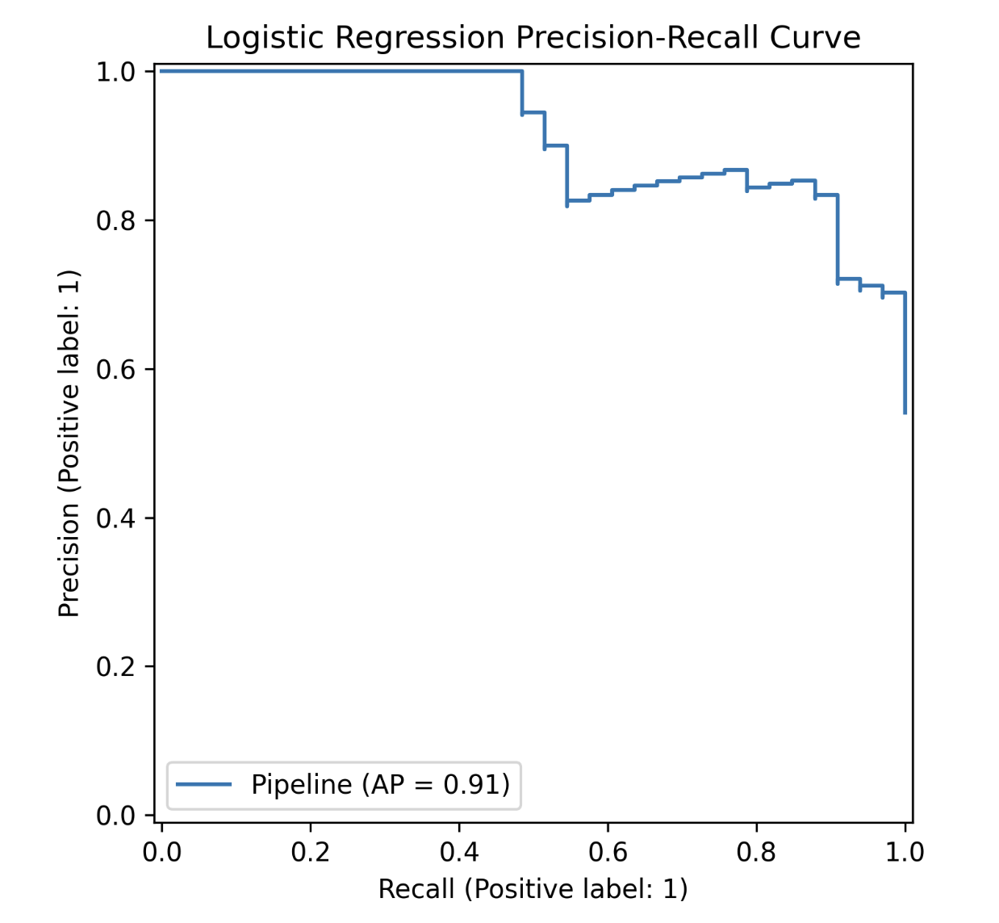
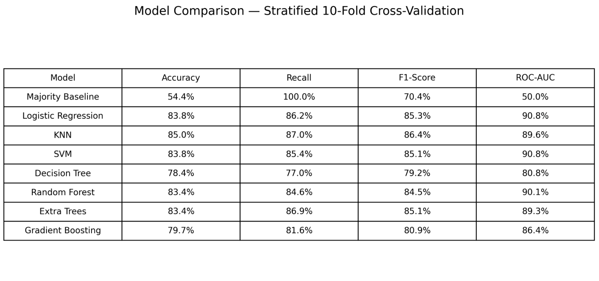

# CMPE 255 - Assignment 1
## Heart Disease

## Project Overview

This project applies the CRISP-DM methodology to the Kaggle
Heart Disease dataset.

## Dataset

[Kaggle Heart Disease Dataset](data/heart.csv)

## CRISP-DM Phases
1. Business Understanding
2. Data Understanding
3. Data Preparation
4. Modeling
5. Evaluation
6. Deployment

## Key Results

Logistic Regression was selected as the primary model based on
its overall balance of predictive performance, interpretability,
and computational efficiency.

## Visualizations

### Target Distribution

### Boxplot

### Correlation Heatmap

### Mutual Information

### Confusion Matrix

### ROC Curve

### Precision-Recall Curve

### Model Comparison

## Repository Contents

- `code/` - Python preprocessing, modeling, and evaluation scripts
- `data/` - Heart Disease dataset
- `report/` - final Assignment 1 report
- `transcripts/` - ChatGPT session transcript

## YouTube Walkthrough

[Insert YouTube link here]

## Kaggle Resources

[Dataset](https://www.kaggle.com/datasets/data855/heart-disease/data)

[Code](https://www.kaggle.com/datasets/data855/heart-disease/code)
